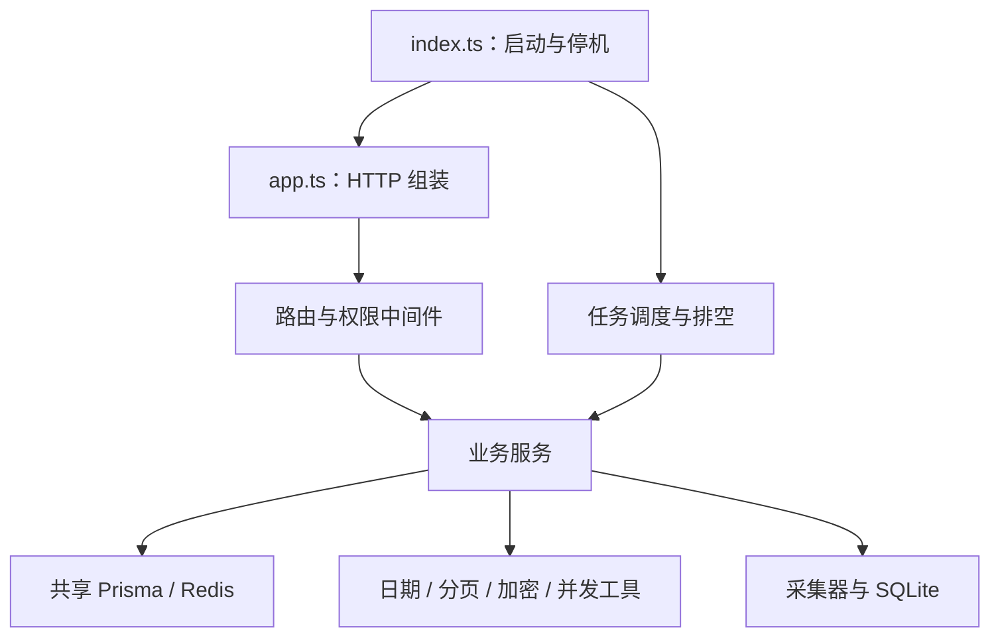

# 后端审查与公共模块重构

日期：2026-10-05。范围为 `backend/src` 的入口、全部路由、中间件、服务和采集器，并核对 Prisma 模型、后端脚本与 Docker 启动入口。

审查开始时有 89 个生产 TypeScript 模块，19,851 行。本轮增加 12 个共享或生命周期模块，完成后为 101 个生产模块，20,051 行，均不含测试。重复实现已收敛，新增的输入校验、并发保护和停机控制使总行数略有增加。工作区已有的 TK 利润和物流变更继续保留。

## 公共模块与依赖边界

| 模块 | 职责与使用方 |
| --- | --- |
| `config/environment.ts` | 先加载环境变量，再初始化 GLM、Ark 和连接配置，避免导入时冻结空配置。 |
| `infrastructure/runtimeResources.ts` | 全应用共用 Prisma 与 Redis，提供缓存降级和连接关闭；业务模块直接依赖资源模块。 |
| `app.ts` | 组装 HTTP 路由与中间件；监听端口、启动任务和信号处理集中在 `index.ts`。 |
| `infrastructure/scheduledTask.ts` | 财务备份、授权刷新、采集导入、回填和历史清理复用调度、串行执行、停止与等待当前任务的逻辑。 |
| `infrastructure/gracefulShutdown.ts` | 统一停止任务、等待 HTTP 请求、关闭采集器、排空导入和释放连接的顺序及超时。 |
| `middleware/requestPermissions.ts` | 复用权限匹配和权限守卫；认证建立当前请求的用户快照，减少同一请求的重复数据库查询。 |
| `utils/queryParams.ts` | 仪表盘、商品分析和生成记录复用严格整数及分页解析。 |
| `utils/calendarDate.ts` | 采集、商品分析、补货、财务输入和利润模板复用真实日历日校验、UTC 日期及日期差计算。 |
| `utils/mapWithConcurrency.ts` | YC 客户端和仓储快照复用并发限制及结果顺序保障。 |
| `services/financeInput.ts` | 财务创建、导入、更新复用业务字段白名单和日期、金额、月份校验。 |
| `services/secretEncryption.ts` | YC、AI 和 Shopee 共用 AES-256-GCM 的 v1 加密格式；各调用方继续管理自己的密钥和错误响应。 |
| `services/aiCallLimits.ts` | AI 中间件和调用账本共用限额配置解析；账本使用上海日历日边界。 |

YC 客户端还合并了库存及库龄的仓库/SKU 分片分页、入库单与收货单的清单和详情请求。Ark 分析与生成合并了 HTTP 请求、超时及 JSON 错误处理。

## 已修复问题

| 问题 | 修复及验证 |
| --- | --- |
| 业务模块导入服务器入口，导致循环依赖、测试导入可能启动服务；用户路由另建 Prisma 客户端 | 迁移到共享资源模块，Redis 延迟连接。导入入口及组装应用的测试确认不监听端口、不启动任务或连接。 |
| 环境变量加载晚于 AI 配置模块读取 | 提前加载配置；使用隔离模块测试验证读取顺序。 |
| 后台任务停止后无法等待当前工作，HTTP 请求可能继续访问已关闭的采集数据库 | 停止新增采集任务及定时任务，等待已接收请求和后台工作，再关闭采集器。导入任务在采集器排空期间保持可用。延迟请求与延迟任务测试覆盖关闭顺序。 |
| Redis 已就绪后 QUIT 仍可能无限等待，拖住 Prisma 关闭 | QUIT 最多等待 1 秒并强制断开；数据库独立关闭。测试覆盖不响应的 QUIT。 |
| AI 日额度查询和记录创建分离，多个请求可能同时占用最后一个名额 | 在短事务中用参数化 SQL 锁定当前 User 行，再检查日额度并创建调用记录。使用 Read Committed 保证等待锁后读取最新提交记录；提交后才请求供应商。成功记录可直接重放。中间件负责同步并发及分钟限流，并按需清理到期空闲状态。 |
| 自定义 AI 服务地址可继承服务器共享 API Key，导致凭据发送到用户指定的其他服务 | 跨服务来源必须配置个人 Key；个人 Key 解密失败也不能将服务器 Key 发给该来源。校验服务地址协议及 URL 内嵌凭据。 |
| 加密数据可接受额外字段或截断的 GCM 认证标签；Shopee 存储内容的字段类型校验不足 | 严格验证 v1 分段、规范 Base64、12 字节 IV、16 字节标签及 token/到期时间类型。测试验证旧 v1 数据兼容、篡改和截断拒绝。 |
| YC 超时只覆盖响应头；Ark JSON 解析失败可能逃出错误处理 | 超时覆盖 YC 的响应体解析；Ark 在统一错误边界内等待 JSON 解析。测试覆盖慢响应体及解析拒绝。 |
| 财务更新可传入业务字段以外的数据，非法金额和月份可能变成服务器错误 | 显式白名单保留服务器用户与审计字段，统一返回输入错误；继续使用已有月度删除时区边界。 |
| 分页宽松解析可接受截断值、数组或过大整数 | 严格解析完整十进制整数，限定页码、条数及偏移。 |
| 夏令时切换日减 24 小时可能仍落在同一本地日期 | 先取得站点本地日历日，再减一个日历日。覆盖洛杉矶夏令时回退用例。 |
| macOS `/var` 与 `/private/var` 或目录别名导致迁移误报历史文件越界；目标目录别名可能绕过包含关系校验 | 使用真实路径判断报表及目标包含关系；失败时清理当前迁移的临时目录并恢复原暂停状态。覆盖文件校验、凭据、路径别名、拒绝内部目标和失败恢复。 |

## 兼容约束

- 继续保留已有路由、权限键、响应字段和 Shopee 原始字节签名校验顺序。
- 请求的认证快照仅由认证中间件建立；直接构造或替换用户对象的请求仍查询数据库确认权限。
- 财务记录继续采用当前共享业务口径，用户及审计字段由服务器控制。
- 补货算法、商品分析评分、哈希排序、利润计算及模板保存格式继续采用各自的原有契约；公共日期工具替换同义实现。
- 加密格式继续使用 v1，已有合法密文可读取；自定义 AI 服务需要与其配套的个人 Key。
- 使用现有 Prisma 模型和索引完成额度保护，数据库结构保持兼容。命令行脚本保留独立客户端的创建和释放周期。
- 停机等待工作的总期限为 20 秒，资源关闭期限为 5 秒。若已接收请求超时，强制关闭 HTTP 连接，SQLite 保留到进程终止，避免仍运行的处理函数访问已关闭的 SQLite。

## 验证结果

后端全量运行 `npm test -- --runInBand --json`：**75 个套件通过，1095 项测试通过，0 失败；4 个套件、13 项测试跳过**。HTTP 回归使用临时 localhost 端口，覆盖健康检查、认证、JSON 限制、Shopee 签名及采集导入等路径。

`npm run build` TypeScript 构建通过；`git diff --check` 通过。

跳过的测试均需要 `USAGE_TEST_DATABASE_URL` 指向独立 PostgreSQL 测试数据库，本次环境未配置该变量：

| 套件 | 跳过项数 |
| --- | ---: |
| `usageEvents.postgres.test.ts` | 4 |
| `usageReport.postgres.test.ts` | 4 |
| `usageHistory.postgres.test.ts` | 2 |
| 新增 `aiUsage.postgres.test.ts` | 3 |

AI 额度的单元测试覆盖同时争抢最后一个名额、上海日期边界、事务提交后才请求供应商、额度满后成功重放及幂等冲突。真实 PostgreSQL 行锁并发验证属于上述跳过项，不能视为已经执行。

外部供应商请求使用测试替身；测试没有发起真实生成、采集或付费调用。
